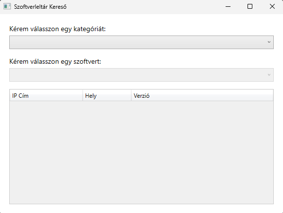
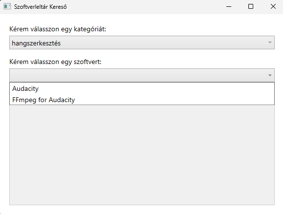
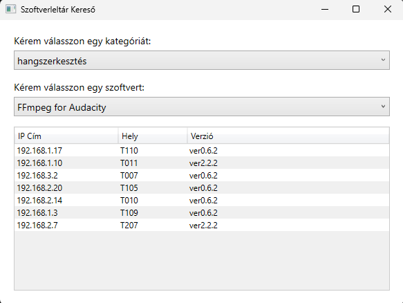

<div class="manual-header">Solti Csongor Péter</div>

# Szoftverleltár (Komplex feladat)

A `gep.txt`, `szoftver.txt` és a `telepites.txt` elnevezésű szöveges állományok nevei megegyeznek a táblák nevével, a kapott adatok kódolása UTF-8. Minden fájlban az első sor a mezőneveket tartalmazza, az adatokat tabulátorral választottuk el.

> **Megjegyzés:** A feladat során az osztályok belső változóinak, property-jeinek és metódusainak elnevezése (a fájlnevek és főbb osztálynevek kivételével) szabadon választható, de minden esetben feleljen meg a **Clean Code** szabályainak (például következetes, angol nyelvű, beszédes elnevezések használata).

**A táblák felépítése:**

<div class="columns">
<div class="column">

*gep tábla:*

| mező neve | típus | leírás |
| :--- | :--- | :--- |
| id | egész szám | a gép azonosítója |
| hely | szöveg | a gép elhelyezkedése (terem azonosító, pl. T403) |
| tipus | szöveg | a gép típusa (asztali, notebook) |
| ipcim | szöveg | a gép IP címe |

</div>
<div class="column">

*szoftver tábla:*

| mező neve | típus | leírás |
| :--- | :--- | :--- |
| id | egész szám | a szoftver azonosítója |
| nev | szöveg | a szoftver neve |
| kategoria | szöveg | a szoftver kategóriája (pl. böngészés) |

</div>
</div>

---

<div class="manual-header">Solti Csongor Péter</div>

<div class="columns">
<div class="column">

*telepites tábla:*

| mező neve | típus | leírás |
| :--- | :--- | :--- |
| gepid | egész szám | a gép azonosítója, amelyre a szoftvert telepítették |
| szoftverid | egész szám | a telepített szoftver azonosítója |
| verzio | szöveg | a telepített szoftver verziója |
| datum | dátum | a telepítés dátuma (lehet üresen hagyott is!) |

</div>
</div>

<style scoped>
.sheldon-img {
  position: absolute;
  bottom: 0px;
  right: 50px;
  width: 650px;
}
.bazinga-text {
  position: absolute;
  bottom: 60px;
  left: 60px;
  font-size: 24px;
  font-style: italic;
  color: #666;
}
</style>


<div class="bazinga-text">
(Sheldon csak azért van itt, hogy kitöltse az üres teret. <b>BAZINGA!</b>)
</div>

---

<div class="manual-header">Solti Csongor Péter</div>

### Konzolos alkalmazás feladatai

1. Hozzon létre egy új C# Console alkalmazást a fejlesztőkörnyezetben, és adja neki a `Console` nevet! A `Program.cs`-ben használjon top-level statement-eket! Hozzon létre mellé egy `szoftverLib` nevű Class Library (osztálykönyvtár) projektet is, amit a későbbi feladatokban használni fog! **A solutiont és a projekteket .NET 10 vagy .NET 11-preview keretrendszerben készítse el!**
2. A Class Library projektben hozza létre a tábláknak megfelelő osztályokat (`Gep.cs`, `Szoftver.cs`, `Telepites.cs`). A mezők típusait a feladatleírás alapján állítsa be!
3. A `szoftverLib` projektben hozzon létre egy `Bekeresek` osztályt! Ebben az osztályban `IEnumerable` használatával (pl. `File.ReadLines` és LINQ) olvassa be a szöveges állományokat (`gep.txt`, `szoftver.txt`, `telepites.txt`), és a későbbi feladatok minden LINQ lekérdezését is ide írja meg külön metódusokba! A konzolos alkalmazásból már csak ezeket a metódusokat hívja meg!

---

<div class="manual-header">Solti Csongor Péter</div>

4. Határozza meg és írassa ki a képernyőre, hogy összesen hány gép szerepel a nyilvántartásban!
5. Egészítse ki a `Szoftver` osztályt egy számított tulajdonsággal (vagy metódussal), amely visszaadja a kategóriát és a szoftver nevét kötőjellel elválasztva (pl. *"böngészés - Google Chrome"*).
6. Csoportosítsa a gépeket típusuk szerint (asztali, notebook), és jelenítse meg a képernyőn, hogy típusonként hány gép található az adatbázisban!
7. Készítsen a `Bekeresek` osztályban egy metódust, amely a telepítések listája alapján visszaadja, hogy hány szoftver van az adott gépre telepítve! Kérjen be a felhasználótól egy gép ID-t, majd írassa ki a gép IP címét, helyét és a rá telepített szoftverek számát! Ha a gép nem létezik, írja ki: *"Nincs ilyen gép."* Ügyeljen a bemenetre: ha a felhasználó véletlenül szöveget ad meg szám helyett, a program figyelmeztessen: *"Csak számot lehet megadni!"*
8. Kérjen be egy szoftver kategóriát (pl. *"böngészés"*), és listázza ki az összes gép IP címét és helyét, ahová ebbe a kategóriába tartozó szoftvert telepítettek! **Extra UX/hibakezelés:** Ha a felhasználó csak számokat ír be (pl. *"123"*), a program figyelmeztessen: *"Csak szöveget lehet megadni kategóriaként!"*, és addig ismételje a bekérést, amíg érvényes (nem csak számokból álló) szöveget nem kap. Ha a felhasználó egy szöveget ír be, de véletlenül elgépeli (pl. *"bön9észés"*), a program futtasson le egy Levenshtein-távolság alapú ellenőrzést! Ezt az ellenőrzést profi módon, egy `ISzovegHasonlito` nevű interfészen (Strategy Pattern) keresztül valósítsa meg! Keresse meg a leginkább hasonlító kategóriát, és kérdezze meg: *"Erre gondolt: böngészés? (y/n)"*.

---

<div class="manual-header">Solti Csongor Péter</div>

### Grafikus alkalmazás (WPF) feladatai

9. Készítsen WPF-es grafikus alkalmazást `GUI` néven, amely szintén a korábban létrehozott Class Library-t használja! A GUI projektet is a legújabb SDK-val, .NET 10 vagy .NET 11-preview keretrendszerben készítse el! Az elkészítésnél kövesse az alábbi feladatokat és a mintákat!
10. A grafikus felületen helyezzen el két lenyíló listát (ComboBox). Az első (felső) lenyíló listába töltse be a szoftverek egyedi kategóriáit!
11. A kategória kiválasztása után a második (alsó) lenyíló listába automatikusan töltődjenek be a kiválasztott kategóriába tartozó szoftverek nevei! Új kategória választása esetén az alsó lista frissüljön!
12. Egy szoftver kiválasztása után jelenjenek meg (például egy DataGridben vagy listában) annak a szoftvernek a telepítési adatai: a gép IP címe, a gép helye (terem) és a telepített verzió. *Tipp: A megjelenítendő adatokat érdemes egy külön `AdatElem` nevű osztályban összefogni a `szoftverLib`-en belül.* Ha a felhasználó új szoftvert választ, a korábbi adatok törlődjenek és a képernyő frissüljön az újakra!

---

<div class="manual-header">Solti Csongor Péter</div>

**Konzolos minták:**

```text
4. feladat: összesen 76 gép szerepel a nyilvántartásban
6. feladat: Gépek száma típusonként:
   asztali - 46 db
   notebook - 30 db
7. feladat: Adjon meg egy gép ID-t: 11
   IP cím: 192.168.2.7
   Hely: T207
   Telepített szoftverek száma: 9 db
8. feladat: Kérem adjon meg egy kategóriát: böngészés
    192.168.1.5 - T110
    192.168.2.14 - T010
    ...
```

---

<div class="manual-header">Solti Csongor Péter</div>

**Kész felület és konzolos kimenet:**

<br>
<p align="center">
  
  &nbsp;&nbsp;&nbsp;
  
  &nbsp;&nbsp;&nbsp;
  
</p>
