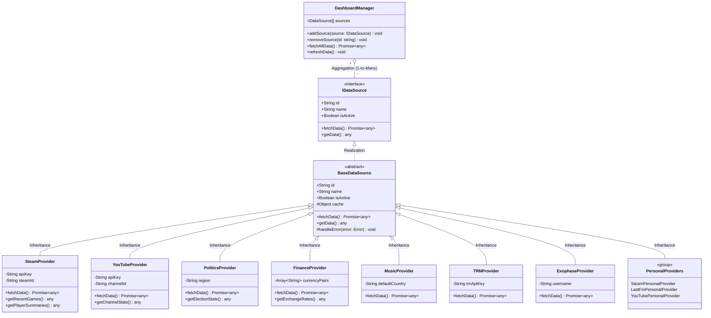

## 3. Class Diagram
Detailed UML diagram showing the implementation of the **Strategy Pattern**. Enhanced with professional OOP relationships (Aggregation, Realization, Inheritance) and cardinality.

