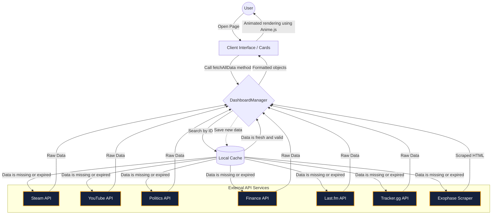

## 2. Data Fetching Process (Flowchart)
This diagram illustrates the complete lifecycle of data flow: starting from user interaction, through local caching, out to external APIs, and back to the UI.

