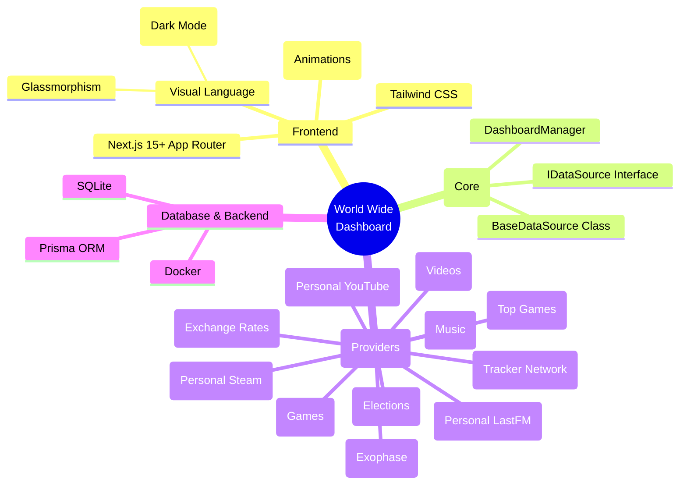

## 1. Mindmap
The complete technological and functional overview of the project. It clearly demonstrates the main modules and the technologies used.

```mermaid
mindmap
  root((World Wide
    Dashboard))
    Frontend
      Next.js 15+ App Router
      Tailwind CSS
      Anime.js (Animations)
      Visual Language
        Glassmorphism
        Dark Theme (Dark Mode)
    Architecture (Core)
      DashboardManager
      IDataSource Interface
      BaseDataSource Class
    Data Sources (Providers)
      SteamProvider (Games)
      YouTubeProvider (Videos)
      PoliticsProvider (Elections)
      FinanceProvider (Exchange Rates)
      MusicProvider (Music)
      TRNProvider (Tracker Network)
      ExophaseProvider (Exophase)
      SteamPersonalProvider (Personal Steam)
      LastFmPersonalProvider (Personal LastFM)
      YouTubePersonalProvider (Personal YouTube)
      SteamTopGamesProvider (Top Games)
    Database & Backend
      Prisma ORM
      SQLite
      Docker
```