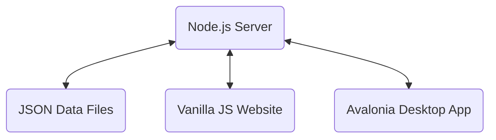

# BetterAdmin Dokumentáció

## Technológiák

### 🖥️ Asztali Alkalmazás (Adminisztráció)
* **Nyelv:** C# (.NET 9.0)
* **Keretrendszer:** Avalonia UI (ReactiveUI)
* **Adatkezelés:** REST API-n keresztül (Newtonsoft.Json)
* **Kulcsfogalmak:** MVVM minta, Reactive Programming, Service-Oriented Architecture.

### 🌐 Webes Felület (Ügyféloldal)
* **Alap:** HTML5, CSS3 (Custom styles)
* **Szkriptek:** Vanilla JavaScript (ES6+).
* **Adatkezelés:** REST API-n keresztül (Fetch API).
* **Funkciók:** Regisztráció, Bejelentkezés, Dinamikus étlap, Asztalfoglalás.

### ⚙️ Szerver (Központi Egység)
* **Nyelv:** Node.js (Express.js)
* **Adattárolás:** JSON alapú fájlrendszer (`bookings.json`, `menu.json`, `tables.json`, `users.json`, `settings.json`).
* **Biztonság:** Bearer Token alapú hitelesítés (szimulált).

---

## 3. Architektúra
A rendszer egy központi Node.js szerverre épül, amely kiszolgálja mind a webes felületet, mind az asztali adminisztrációs alkalmazást.



### Adatfolyam
1. **Szerver:** Kezeli az HTTP kéréseket, olvassa és írja a JSON fájlokat, valamint biztosítja a hitelesítést.
2. **Web:** A böngészőből kommunikál a szerverrel. Bejelentkezés után a felhasználó saját néven foglalhat asztalt.
3. **Asztali App:** Teljes körű adminisztrációs jogkörrel rendelkezik. Kezeli a foglalásokat, az étlapot, az asztalokat és a felhasználókat.

---

## 4. Fejlesztői Útmutató

### Előfeltételek
* .NET 9 SDK
* Node.js (v18+)
* Git

### Környezet Beállítása
1. **Szerver indítása:**
   ```bash
   cd src/server
   npm install
   node index.js
   ```
2. **Weboldal elérése:**
   Nyisd meg a `http://localhost:3000` címet.
3. **Asztali Alkalmazás:**
   Fordítsd le és futtasd a `src/app/RusztikusAdmin` mappából a `dotnet run` paranccsal.

### Megvalósítási Részletek
* **Hálózati elérés:** A szerver a `0.0.0.0` címen figyel, így a helyi hálózaton (pl. Wi-Fi hotspot) keresztül más eszközök is csatlakozhatnak.
* **Konfiguráció:** Az asztali alkalmazás a `server_config.json` fájlból olvassa ki a szerver IP címét.
* **Védelem:** Az `admin` felhasználó törlése szoftveresen és szerveroldalon is tiltott.

---

## 5. Felhasználói Útmutató

### Adminisztrátoroknak (Asztali App / Web Admin)
1. **Felhasználók:** A "Felhasználók" menüpontban megtekinthetők a regisztrált tagok és törölhetők a nemkívánatos fiókok.
2. **Beállítások:** Az étterem neve, címe és nyitvatartása globálisan módosítható.
3. **Statisztikák:** Valós idejű adatok a napi foglalásokról és a szabad asztalokról.

### Ügyfeleknek (Weboldal)
1. **Fiók:** Regisztráció és bejelentkezés után érhető el a foglalási funkció.
2. **Foglalás:** A rendszer automatikusan kitölti a bejelentkezett felhasználó adatait.

---

## 6. Tesztelés
* **Szerver:** API végpontok tesztelése (Postman/Curl).
* **Asztali App:** MVVM egységtesztek és UI funkcionális tesztek.
* [Tesztelési Terv](docs/TESZTELESI_TERV.md)