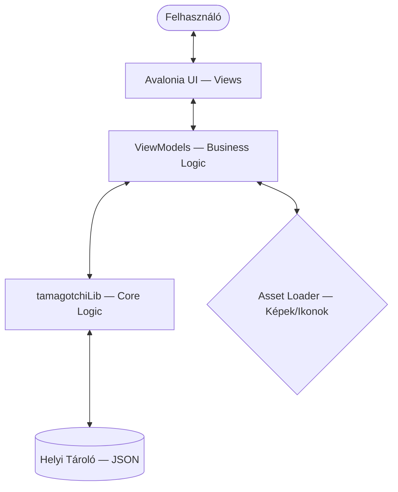
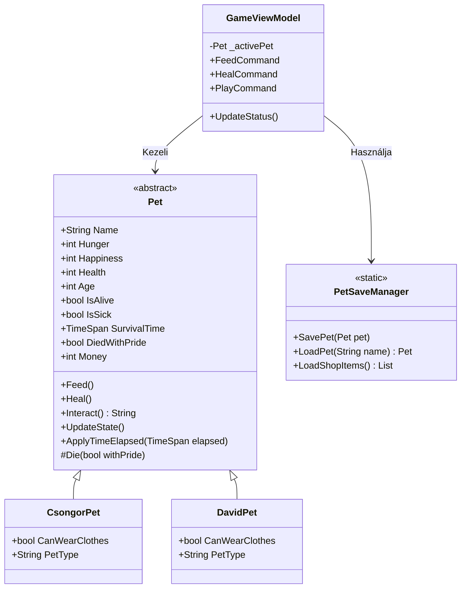

# UML Dokumentáció

## Rendszerarchitektúra (High-Level)
Az alábbi diagram szemlélteti a projekt fő komponensei közötti kapcsolatot és az adatáramlást.

---

## Osztályhierarchia (Class Diagram)
A projekt objektumorientált felépítése, kiemelve a `Pet` öröklődést és a ViewModellek kapcsolatát.

## Komponensek Leírása
- **Avalonia UI:** A felhasználói felületért felelős réteg (XAML).
- **ViewModels:** Az MVVM mintát követve összeköti a nézetet a logikával, kezeli a parancsokat (Commands).
- **tamagotchiLib:** A játék magja. Itt történik a statisztikák számítása, az idő-kompenzáció és az állapotgép kezelése.
- **PetSaveManager:** JSON szerializációért felelős segédosztály, amely a mentéseket és a bolt adatait kezeli.
- **Assets:** Dinamikus képbetöltő modul, amely az aktuális állapot (pl. ruha, betegség) alapján választja ki a megfelelő fotót.
